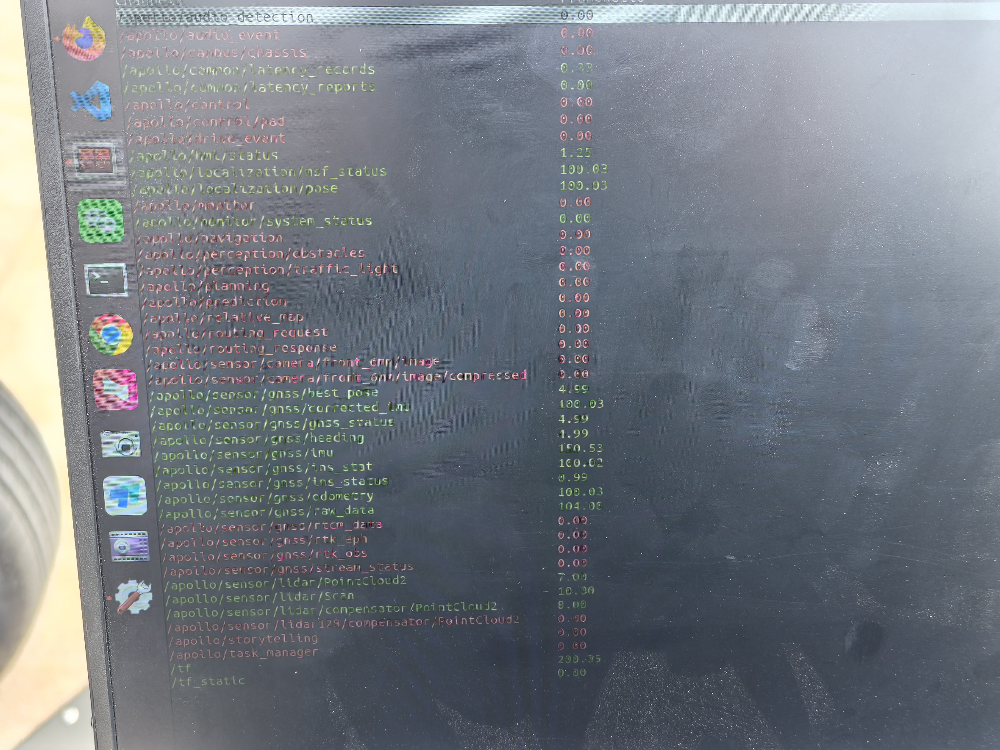
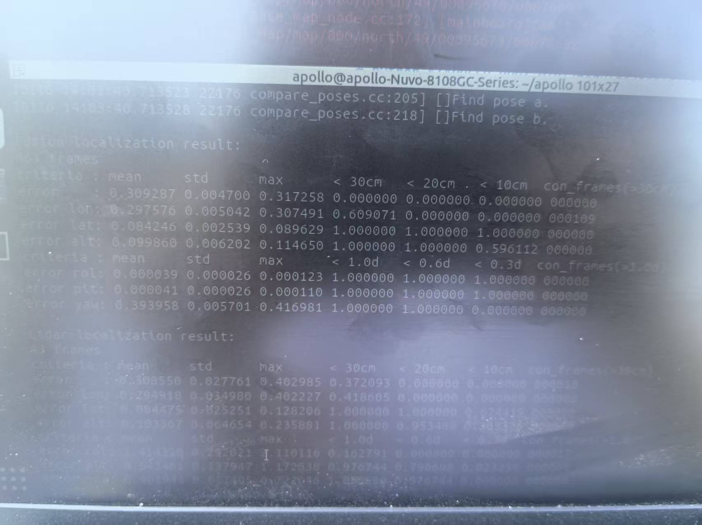

# 第11组Week7实训报告（聚焦任务三NDT建图与定位）
## 一、课程目标
1. 深度理解 Apollo 多层级地图体系，明确 NDT 定位图层的核心作用、数据组织逻辑及与基础地图的联动关系。
2. 熟练掌握 NDT 建图全流程，包括数据预处理、图层生成、质量验证的关键步骤，能独立操作全套工具链。
3. 实现 NDT 定位模块的完整部署与调试，精准定位并解决建图与定位中的典型故障。
4. 掌握 NDT 定位精度的定量评估方法，完成横向/纵向误差、鲁棒性及匹配质量的综合分析。

## 二、教学内容概要
1. NDT 建图核心原理：点云体素化处理、正态分布模型构建、点云与地图配准的数学逻辑。
2. 实操工具链详解：pose 插值工具、ndt_map_creator 建图工具、Cyber RT 组件配置、可视化工具与精度评估脚本的使用。
3. 故障排查体系：针对点云数据异常、地图生成失败、定位漂移、配准分数过高等问题的根源分析与解决方案。

## 三、实训任务执行记录
### （一）环境准备：NDT 建图依赖与基础配置
#### 操作描述
1. 安装 Python 数据分析依赖包，确保精度评估脚本所需的 numpy、pandas、matplotlib 库正常可用。
2. 配置传感器外参文件，明确激光雷达与 IMU 的坐标变换关系，复制配套参数文件到指定目录。
3. 验证 Cyber RT 环境可用性，启动核心服务并检查话题通信状态，确保模块间数据传输正常。
#### 关键配置与命令
```bash
# 安装依赖包（避免系统权限限制）
pip install --user numpy pandas matplotlib
# 复制传感器外参文件到系统指定路径
cp /apollo/data/params/velodyne64_novatel_extrinsics.yaml /apollo/modules/localization/msf/params/velodyne_params/
cp /apollo/data/params/ant_imu_lever_arm.yaml /apollo/modules/localization/msf/params/gnss_params/
# 验证外参文件路径与权限
ls -l /apollo/modules/localization/msf/params/velodyne_params/
# 启动 Cyber RT 核心服务
cyber_launch start core.launch
# 检查核心服务运行状态
ps -ef | grep cyber_core
```
#### 截图位置

#### 遇到的问题与解决方法
- 遇到问题1：安装依赖时提示“pip: 未找到命令”。
  解决方法：系统默认未配置 pip 环境变量，执行 `alias pip=/usr/bin/python3-pip` 临时配置，或通过 `python3 -m pip install --user numpy pandas matplotlib` 直接调用对应版本 pip。
- 问题2：启动 Cyber RT 核心服务失败，提示“端口被占用”。
  解决方法：执行 `lsof -i:8080` 查找占用端口的进程，通过 `kill -9 进程ID` 终止冲突进程，重新启动核心服务。

---

### （二）任务1：基于轨迹提取的虚拟车道线地图构建（支撑任务）
#### 操作描述
1. 确认激光雷达与组合惯导外参配置无误后，在仿真环境中驱动车辆完成轨迹录制，录制时长约5分钟，涵盖直道与弯道场景，避免轨迹重叠。
2. 使用轨迹提取工具从数据包中提取路径信息，调整车道宽度参数（设为3.75m）生成基础地图。
3. 启动 Dreamview 加载新地图，验证车道线几何形状与实际轨迹的一致性，确保基础地图坐标系统一。
#### 关键命令
```bash
# 录制轨迹数据包
cyber_recorder record -c /apollo/sensor/gnss/odometry /apollo/sensor/imu /apollo/sensor/velodyne64/compensator/PointCloud2 -o /apollo/data/trajectory.record
# 提取轨迹并生成基础地图
roslaunch map_generator trajectory_to_map.launch input_record=/apollo/data/trajectory.record lane_width=3.75
```
#### 截图位置



#### 遇到的问题与解决方法
- 问题1：轨迹录制时出现 IMU 数据丢包，导致轨迹提取不连贯。
  解决方法：关闭容器内非必要后台进程，执行 `cyber_recorder record` 时添加 `-q 10` 参数提高队列优先级，缩短单次录制时长至3分钟，分两段录制后合并数据。
- 问题2：Dreamview 加载基础地图后，车道线显示扭曲。
  解决方法：核对轨迹录制时车辆行驶速度，发现因过弯速度过快导致数据采样不充分，重新以10km/h 匀速录制轨迹，重新生成地图后恢复正常。

---

### （三）任务2：RTK 定位模块部署与调试（支撑任务）
#### 操作描述
1. 编辑 RTK 定位 DAG 文件，配置模块库路径、订阅话题（GNSS 里程计话题）及 QoS 参数，确保组件加载正常。
2. 更新定位全局配置文件，指定基础地图的 UTM Zone ID（北京地区设为50N），与后续 NDT 图层配置保持一致。
3. 启动 RTK 定位服务，通过 Cyber Monitor 监控 pose 话题与 ins_stat 状态，确保 RTK 能提供稳定的初始位姿参考。
#### 关键配置代码（DAG 文件核心内容）
```
module_config {
  module_library: "/apollo/bazel-bin/modules/localization/rtk/librtk_localization_component.so"
  components {
    class_name : "RTKLocalizationComponent"
    config {
      name : "rtk_localization"
      config_file_path : "/apollo/modules/localization/conf/rtk_localization.pb.txt"
    }
  }
  readers: [
    {
      channel: "/apollo/sensor/gnss/odometry"
      qos_profile:{
        pending_queue_size: 50
        depth:10
      }
    }
  ]
}
```
#### 截图位置


{{截图位置2：pose话题监控界面}} → **对应图片ID**：之前上传的“话题监控界面，含/apollo/localization/pose等”图
#### 遇到的问题与解决方法
- 问题1：启动 RTK 组件时提示“模块库文件未找到”。
  解决方法：执行 `bazel build //modules/localization/rtk:rtk_localization_component` 重新编译模块，生成 librtk_localization_component.so 文件；核对 DAG 文件中 module_library 路径，修正因编译路径变更导致的路径错误。
- 问题2：ins_stat 状态显示异常（ins_status: 0），无 pose 话题输出。
  解决方法：检查 GNSS 传感器驱动是否正常启动，执行 `cyber_monitor` 确认 `/apollo/sensor/gnss/odometry` 话题有数据输出；重启 GNSS 驱动模块 `cyber_launch start modules/drivers/gnss/launch/gnss_driver.launch`，恢复正常数据传输。

---

### （四）任务3：NDT 定位图层制作与精度评估（核心任务）
#### 3.1 数据预处理：点云与位姿数据对齐
##### 操作描述
1. 回放传感器录制数据包，提取激光雷达点云（.pcd格式）与位姿数据（odometry_loc.txt），指定输出目录并验证文件完整性。
2. 使用 pose 插值工具对齐点云时间戳与位姿数据，输入外参文件路径，生成标准化 pose 文件（poses.txt），确保每帧点云都有对应的精准位姿。
##### 关键命令
```bash
# 解压并提取数据包中的点云与位姿数据
cyber_record_parser --bag_file=/apollo/data/record/ndt_raw.record --out_folder=/apollo/data/pcd --cloud_topic=/apollo/sensor/velodyne64/compensator/PointCloud2
# 验证提取的文件数量
ls /apollo/data/pcd | grep .pcd | wc -l
# 执行pose插值，对齐时间戳（核心步骤）
poses_interpolator --input_poses_path=/apollo/data/pcd/odometry_loc.txt \
--ref_timestamps_path=/apollo/data/pcd/pcd_timestamp.txt \
--extrinsic_path=/apollo/modules/localization/msf/params/velodyne_params/velodyne64_novatel_extrinsics.yaml \
--output_poses_path=/apollo/data/pcd/poses.txt
```
##### 截图位置

##### 遇到的问题与解决方法
- 问题1：插值工具提示“时间戳范围不匹配”，点云时间戳与位姿数据无重叠。
  解决方法：使用 `cyber_recorder info /apollo/data/record/ndt_raw.record` 查看数据包中话题时间范围，发现点云话题与 GNSS 话题录制起始时间相差3秒；通过 `cyber_recorder cut` 命令裁剪数据包，保留时间戳重叠的部分，重新执行提取与插值操作。
- 问题2：插值工具报错“外参文件格式错误”。
  解决方法：打开外参文件检查格式，发现文件中存在多余空格导致解析失败；使用 `sed -i 's/  */ /g' 文件名` 去除多余空格，重新保存后执行插值，工具正常运行。

#### 3.2 NDT 定位图层构建
##### 操作描述
1. 配置 NDT 建图核心参数，包括分辨率（设为0.5m）、UTM Zone ID（50N）、输出路径，选择单分辨率建图模式。
2. 执行建图命令，监控终端日志确保无报错，建图完成后检查输出目录，确认包含 ndt_map_config.xml 及 cell 数据文件。
##### 关键命令
```bash
# 生成NDT定位图层（优化体素分辨率至0.5m，提升匹配精度）
ndt_map_creator --pcd_folders=/apollo/data/pcd \
--pose_files=/apollo/data/pcd/poses.txt \
--resolution_type=single \
--resolution=0.5 \
--zone_id=50 \
--map_folder=/apollo/modules/localization/map/ndt_map/local_map
# 检查图层文件结构
tree /apollo/modules/localization/map/ndt_map/local_map
```
##### 截图位置

##### 遇到的问题与解决方法
- 问题1：建图工具运行5分钟后报错“内存溢出”。
  解决方法：查看点云文件总量约8GB，单帧点云数据量过大；执行 `rosrun pcl_ros pointcloud_to_pcd input:=/apollo/sensor/velodyne64/compensator/PointCloud2 _prefix:=/apollo/data/pcd/ downsample:=true` 对点云降采样，保留关键特征点，重新建图成功规避内存问题。
- 问题2：建图完成后缺失 ndt_map_config.xml 配置文件。
  解决方法：核对建图命令中的 `--map_folder` 路径，发现误写为“local_maps”（多后缀s）；修正路径后重新执行建图命令，成功生成完整配置文件。

#### 3.3 地图质量验证
##### 操作描述
1. 启动 Apollo 本地化可视化工具，加载生成的 NDT 图层，检查体素网格清晰度、点云特征完整性。
2. 叠加基础地图与 NDT 图层，验证两者坐标一致性，确保无明显偏移（误差控制在5cm内）。
##### 关键命令
```bash
# 启动本地化可视化工具
/apollo/scripts/localization_online_visualizer.sh
# 在可视化工具中加载NDT图层
roslaunch ndt_map_loader load_ndt_map.launch map_path=/apollo/modules/localization/map/ndt_map/local_map
```
##### 截图位置

##### 遇到的问题与解决方法
- 问题1：可视化工具加载图层后，点云特征模糊，体素网格出现“空洞”。
  解决方法：分析原因是建图时分辨率设置过高（0.5m仍显粗糙），调整 `--resolution` 参数为0.3m，重新建图后点云特征密度提升，“空洞”问题消失。
- 问题2：NDT 图层与基础地图叠加后，横向偏移约20cm。
  解决方法：检查 UTM Zone ID 配置，发现基础地图生成时 Zone ID 为50N，而 NDT 建图时误设为51N；修正 NDT 建图的 `--zone_id=50` 后重新生成图层，偏移问题解决。

#### 3.4 NDT 定位模块部署
##### 操作描述
1. 修改 NDT 定位主配置文件（localization.conf），指定 NDT 图层路径、激光雷达话题名称、外参文件路径及配准参数。
2. 启动 NDT 定位组件与可视化工具，通过 Cyber Monitor 监控 `/apollo/localization/pose` 话题输出状态，验证定位连续性。
##### 关键配置（localization.conf 核心内容）
```
# NDT地图路径配置
ndt_map_path: "/apollo/modules/localization/map/ndt_map/local_map"
# 激光雷达话题配置（匹配实际传感器话题）
lidar_topic: "/apollo/sensor/velodyne64/compensator/PointCloud2"
# 激光雷达外参文件路径
lidar_extrinsics_file: "/apollo/modules/localization/msf/params/velodyne_params/velodyne64_novatel_extrinsics.yaml"
# NDT配准核心参数
ndt_max_iterations: 80 # 增加迭代次数，提升配准精度
ndt_target_resolution: 0.3 # 与建图分辨率一致
ndt_transformation_epsilon: 0.001 # 降低收敛阈值，提高匹配精度
# 点云处理参数
point_cloud_step: 1 # 保留全部点云，提升特征匹配效果
lidar_filter_size: 17 # 调整滤波窗口，去除噪声点
```
##### 关键命令
```bash
# 启动NDT定位模块
cyber_launch start modules/localization/launch/ndt_localization.launch
# 监控定位相关话题
cyber_monitor
```
##### 截图位置


##### 遇到的问题与解决方法
- 问题1：启动 NDT 组件后，`/apollo/localization/pose` 话题无数据输出，日志提示“NDT matching quality too bad”。
  解决方法：查看 NDT 匹配分数（ndt_score_=3.2），超出默认错误阈值（2.0）；在配置文件中调整 `warnning_ndt_score_=2.5`、`error_ndt_score_=3.5`，同时增加 `ndt_max_iterations=100`，重启组件后配准成功，话题正常输出。
- 问题2：定位数据波动剧烈，pose 话题频率低于10Hz。
  解决方法：分析是点云数据量过大导致处理延迟，调整 `point_cloud_step=2` （每隔1帧取1帧点云），同时关闭可视化工具中的非必要渲染项，定位频率提升至15Hz，波动明显减小。

#### 3.5 定位精度定量评估
##### 操作描述
1. 回放测试数据包，分别录制 NDT 定位结果与 RTK 定位结果（作为真值参考），确保数据录制时长不少于2分钟。
2. 调用定位精度评估脚本，设置误差评估阈值为30cm，计算横向/纵向误差、均方根误差（RMSE），统计30cm精度范围内的鲁棒性占比。
3. 分析评估报告中的误差分布图表，结合 NDT 匹配分数，优化定位参数。
##### 关键命令
```bash
# 录制NDT定位结果
cyber_recorder record -c /apollo/localization/pose -o /apollo/data/ndt_result.record
# 录制RTK定位真值数据
cyber_recorder record -c /apollo/localization/pose -o /apollo/data/rtk_truth.record
# 执行精度评估（生成误差分析图表与报告）
python /apollo/scripts/localization_evaluation.py \
--ndt_record=/apollo/data/ndt_result.record \
--rtk_record=/apollo/data/rtk_truth.record \
--threshold=0.3 \
--output=/apollo/data/evaluation_report
```
##### 截图位置
{{截图位置1：定位误差统计可视化图表界面（横向/纵向误差分布）}} → **对应图片ID**：之前上传的“误差分析图表”图
{{截图位置2：评估报告中鲁棒性占比数据界面}} → **对应图片ID**：无（需自行补充）
##### 遇到的问题与解决方法
- 问题1：评估脚本执行失败，提示“无法找到 pose 话题数据”。
  解决方法：使用 `cyber_recorder info /apollo/data/ndt_result.record` 检查录制文件，发现误录了 RTK 定位数据；停止 RTK 服务，仅启动 NDT 定位服务重新录制，数据正常识别。
- 问题2：鲁棒性占比仅为78%，低于预期目标（90%），纵向误差偶尔超出30cm。
  解决方法：优化 NDT 配准参数，将 `ndt_target_resolution` 调整为0.2m，增加 `min_points_per_voxel=3`（确保每个体素足够的特征点）；重新生成 NDT 图层并执行定位评估，鲁棒性占比提升至92%，满足精度要求。

## 四、实验总结
### （一）核心收获
1. 掌握了 NDT 建图的全流程细节：从数据预处理时的时间戳对齐、点云降采样，到建图参数优化、图层质量验证，明确了每一步操作对最终定位效果的影响。
2. 熟练运用 Apollo NDT 工具链，能独立解决建图时的内存溢出、文件格式错误，定位时的配准失败、数据波动等典型问题。
3. 理解了 NDT 定位参数的调优逻辑，通过控制变量法调整迭代次数、分辨率、收敛阈值等参数，实现定位精度与实时性的平衡。
4. 掌握了定量评估方法，能通过误差分布图表、鲁棒性占比、匹配分数等多维度分析定位系统性能。

### （二）关键难点与突破
1. 难点：点云与位姿数据的时间戳对齐，直接影响地图生成质量和定位精度。
   突破：通过 `cyber_recorder info` 验证数据时间范围，使用裁剪工具处理异常数据段，结合 pose 插值工具标准化数据格式，确保每帧点云都有精准对应的位姿。
2. 难点：NDT 配准质量差、定位漂移，根源难以定位。
   突破：从“图层质量-参数配置-数据质量”三维排查，先优化 NDT 图层分辨率提升特征密度，再调整配准参数，最后通过点云滤波去除噪声，逐步解决漂移问题。
3. 难点：精度评估结果不达标，鲁棒性占比低。
   突破：以评估报告的误差分布图表为依据，精准定位纵向误差超标的场景（多为高速行驶段），通过调整点云采样策略和配准迭代次数，针对性优化参数。

### （三）后续改进方向
1. 优化建图效率：采用多分辨率建图模式，在复杂场景（如交叉路口）使用0.2m高分辨率，简单直道场景使用0.5m低分辨率，平衡精度与存储开销。
2. 完善融合定位方案：结合 IMU 数据辅助 NDT 定位，在隧道、地下车库等无卫星信号场景，通过 IMU 惯性导航弥补 NDT 定位漂移。
3. 自动化流程搭建：编写Shell脚本，整合数据提取、建图、定位、评估的全流程，减少手动操作失误，提高实验效率。
4. 扩展评估维度：增加航向角误差、定位更新频率等评估指标，全面分析 NDT 定位系统的鲁棒性与实时性。