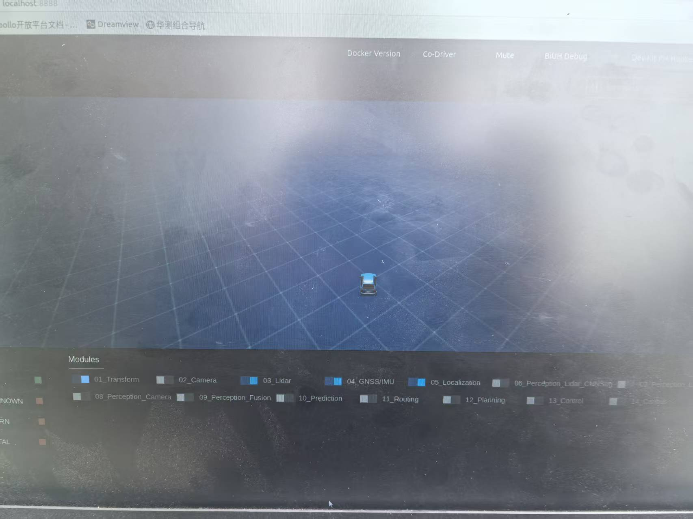
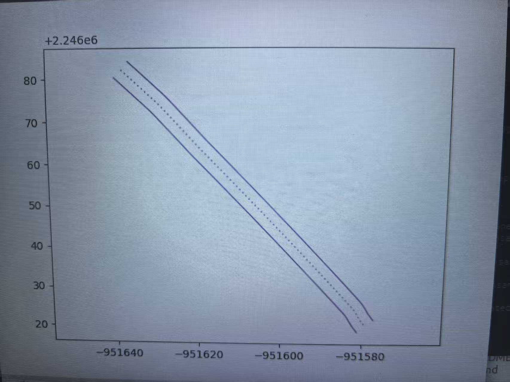
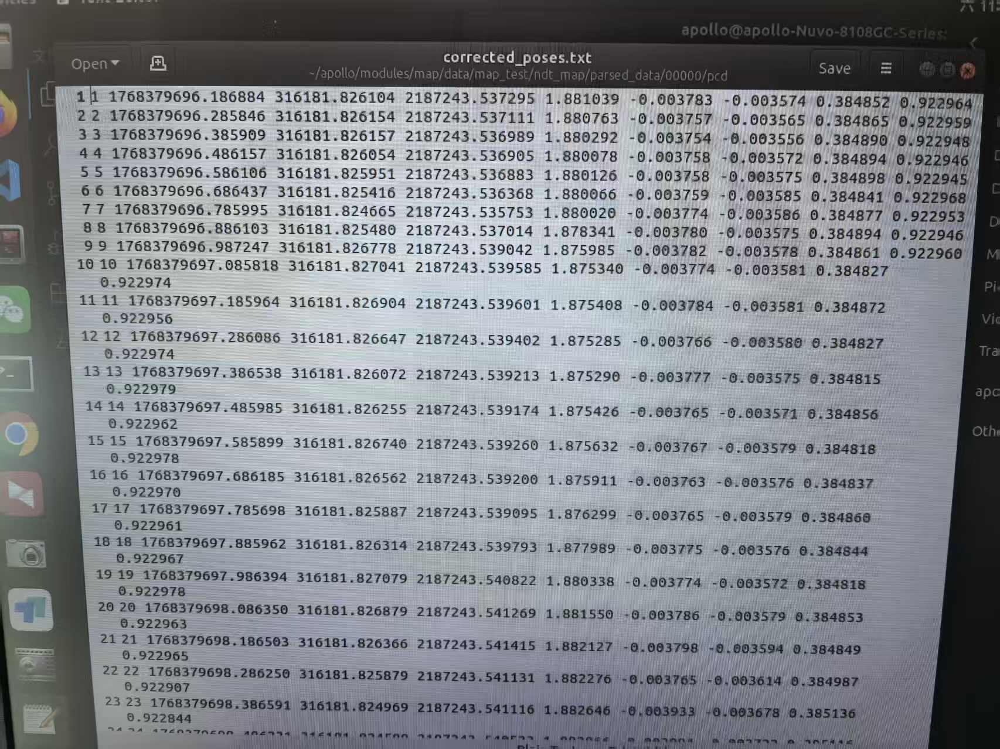
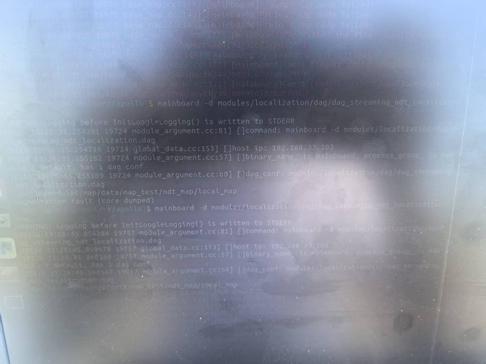
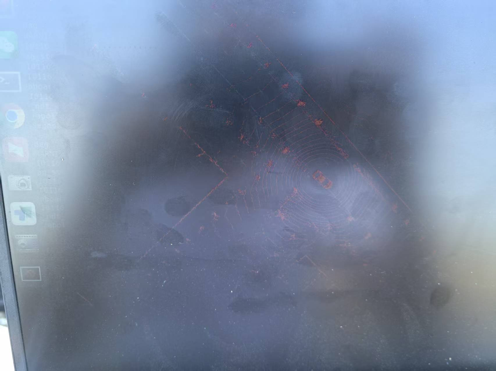

# team11_week7_final.md
# Apollo 建图与定位技术实战实训报告
- 小组：第11组
- 姓名：张美奂

[TOC]

---

## 一、实训任务概述
本次实训围绕 Apollo 自动驾驶平台的建图与定位核心技术展开，完成三大核心任务：基于轨迹提取的虚拟车道线地图构建、RTK 定位模块部署与调试、NDT 定位图层制作与精度评估。通过实操掌握 Apollo 地图体系逻辑、定位算法原理及工具链使用，实现从数据录制到精度评估的全流程落地。

---

## 二、Apollo 建图（任务1：基于轨迹提取的虚拟车道线地图构建）
### 2.1 录制数据集（任务1.1 传感器标定与数据采集）
1. **启动并进入 Apollo 的 Docker 容器**
在本地终端输入命令，启动容器并进入交互环境：
```bash
cd ~/apollo
bash docker/scripts/dev_start.sh
bash docker/scripts/dev_into.sh
```

2. **启动 Dreamview 网页**
在容器内执行命令，启动可视化平台：
```bash
bash scripts/bootstrap.sh
```

3. **Dreamview 启动核心模块**
在浏览器访问 `http://localhost:8888` 打开 Dreamview，手动启动 Transform、Lidar、GPS、Localization 模块。
在容器内通过监控工具验证话题通信状态：
```bash
cyber_monitor
```
**截图位置**：



4. **组合导航驱动配置**
按照指导完成组合导航设置，使 Gnss 模式切换为 RTK 稳定解定位定向，确保定位数据精度。
**截图位置**：


5. **录制轨迹数据**
在容器内输入命令，开启数据录制功能，驱动车辆行驶一段较长直线（避免轨迹重叠与交叉）：
```bash
cyber_recorder record -a -i 600 -o localization.record
```
按下 `ctrl+c` 结束录制，生成的数据包自动保存至当前目录。

### 2.2 构建虚拟车道地图（任务1.2 轨迹处理与地图生成 + 任务1.3 地图可视化验证）
1. **首先提取轨迹路径**
在容器内执行命令，从录制的数据包中提取位置路径信息，生成 `path.txt` 文件：
```bash
./bazel-bin/modules/tools/map_gen/extract_path \
./path.txt \
data/bag/localization/*
```

2. **修正车道线宽度的参数**
编辑地图生成脚本，调整车道宽度为 5.0m：
```bash
vim apollo/modules/tools/map_gen/map_gen_single_lane.py
```
修改脚本中核心参数：
```py
LANE_WIDTH = 5.0
```

3. **修复软件源并安装依赖**
容器内编辑软件源配置文件，替换为清华源以提升依赖安装速度：
```bash
sudo vim /etc/apt/sources.list
```
**截图位置**：

保存后执行更新与依赖安装命令：
```bash
sudo apt update
sudo apt-get install tcl-dev tk-dev python3-tk
```

4. **生成地图并可视化验证**
执行脚本生成虚拟车道地图，指定输入数据路径与输出地图名称：
```bash
./supplement/build_lane_map.sh data/bag/localization/ map_test
```
**截图位置**：

重启 Dreamview 使地图能够生效：
```bash
bash scripts/bootstrap.sh restart
```
在 Dreamview 地图菜单中选择 `map_test`，验证车道线与实际轨迹一致性。
**截图位置**：


---

## 三、定位模块部署与调试
### 3.1 RTK 算法定位（任务2：RTK 定位模块部署与调试）
#### 3.1.1 组件启动配置（任务2.1）
1. **修改 RTK 定位 DAG 文件**
编辑 DAG 配置文件，配置模块库路径、订阅话题等核心参数：
```bash
vim /apollo/modules/calibration/data/dev_kit pix hooke/localization_dag/dag_streaming_rtk_localization.dag
```
**截图位置**：


2. **修改定位全局配置文件**
将默认配置文件复制到指定目录并编辑：
```bash
cp /apollo/modules/localization/conf/localization.conf /apollo/modules/calibration/data/dev_kit pix hooke/localization_conf/
vim /apollo/modules/calibration/data/dev_kit pix hooke/localization_conf/localization.conf
```
修改关键配置项（第5行与第115行）：
```bash
--map_dir=/apollo/modules/map/data/map_test
--local_utm_zone_id=49
```
使用 `ctrl+shift+f` 全局搜索 `zone_id`，将所有相关配置统一改为 49。

#### 3.1.2 定位状态监控（任务2.2）
启动 RTK 定位服务：
```bash
mainboard -d modules/localization/dag/dag_streaming_rtk_localization.dag
```
通过 `cyber_monitor` 监控定位状态（ins_stat）与位姿输出（pose）话题：
**截图位置**：


### 3.2 NDT 算法定位（任务3：NDT 定位图层制作与精度评估）
#### 3.2.1 定位图层生产（任务3.1）
1. **使用脚本修复 pose 数据**
由于原始数据坐标系不匹配，使用 Python 脚本将 `corrected_poses.txt` 中的 Zone 坐标转换为 49，并校正负数数据：
```python
import os
import sys
import glob
try:
    from pyproj import Proj, transform
except ImportError:
    sys.exit(1)

def convert_line(line, p_src, p_dst):
    parts = line.strip().split()
    if len(parts) < 5:
        return line
    try:
        x_src = float(parts[2])
        y_src = float(parts[3])
        x_dst, y_dst = transform(p_src, p_dst, x_src, y_src)
        parts[2] = "{:.6f}".format(x_dst)
        parts[3] = "{:.6f}".format(y_dst)
        return " ".join(parts) + "\n"
    except Exception:
        return line

def process_file(file_path):
    try:
        p_src = Proj(init='epsg:32651')
        p_dst = Proj(init='epsg:32649')
    except Exception:
        sys.exit(1)
    backup_path = file_path + ".bak"
    if not os.path.exists(backup_path):
        os.rename(file_path, backup_path)
    source_file = backup_path
    converted_lines = []
    with open(source_file, 'r') as f:
        for line in f:
            converted_lines.append(convert_line(line, p_src, p_dst))
    with open(file_path, 'w') as f:
        f.writelines(converted_lines)

def main():
    search_root = "/home/apollo/apollo/modules/map/data/map_test/ndt_map/parsed_data"
    if sys.version_info >= (3, 5):
        search_pattern = os.path.join(search_root, "**", "corrected_poses.txt")
        files = glob.glob(search_pattern, recursive=True)
    else:
        files = glob.glob(os.path.join(search_root, "*", "pcd", "corrected_poses.txt"))
    if not files:
        return
    for file_path in files:
        process_file(file_path)

if __name__ == "__main__":
    main()
```
**截图位置**：


2. **生成 NDT 与 MSF 地图**
执行脚本生成 NDT 定位图层：
```bash
bash supplement/ndt_map_creator.sh \
data/bag/localization \
/apollo/modules/calibration/data/dev_kit pix hooke/lidar_params/lidar_novatel_extrinsics.yaml \
49 \
/apollo/modules/map/data/map_test/ndt_map \
lidar
```
执行脚本生成 MSF 可视化图层：
```bash
bash supplement/msf_map_creator.sh \
data/bag/localization \
/apollo/modules/calibration/data/dev_kit pix hooke/lidar_params/lidar_novatel_extrinsics.yaml \
51 \
/apollo/modules/map/data/map_test \
lidar
```

#### 3.2.2 定位运行与可视化分析（任务3.2）
1. **修正定位配置文件**
编辑 `localization.conf` 文件，确保配置与地图信息匹配：
```bash
vim modules/localization/conf/localization.conf
```
核心配置内容：
```conf
# 1. 指向包含 config.xml 和 map 文件夹的上一级目录
--map_dir=/apollo/modules/map/data/map_test
# 2. 确保 Zone ID 正确
--local_utm_zone_id=49
# 3. 开启激光定位开关
--enable_lidar_localization=true
```

2. **恢复 NDT 定位 DAG 文件**
编辑 DAG 文件，确保订阅话题类型正确：
```bash
vim modules/localization/dag/dag_streaming_ndt_localization.dag
```
核心配置内容：
```dag
readers: [
{
# 必须是里程计/GPS话题，不能是 PointCloud2
channel: "/apollo/sensor/gnss/odometry"
...
}
]
```

3. **修改 NDT 启动文件**
编辑定位组件启动配置文件：
```bash
vim /apollo/modules/calibration/data/dev_kit pix hooke/localization_dag/dag_streaming_ndt_localization.dag
```
核心配置内容：
```dag
module_config {
    module_library : "/apollo/bazel-bin/modules/localization/ndt/libndt_localization_component.so"
    components {
        class_name : "NDTLocalizationComponent"
        config {
            name : "ndt_localization"
            flag_file_path : "/apollo/modules/localization/conf/localization.conf"
            readers: [
                {
                    channel: "/apollo/sensor/gnss/odometry"
                    qos_profile: {
                        depth : 10
                    }
                    pending_queue_size: 50
                }
            ]
        }
    }
}
```

4. **启动 NDT 定位服务**
```bash
mainboard -d modules/localization/dag/dag_streaming_ndt_localization.dag
```
**截图位置**：


5. **复制可视化 DAG 文件**
将 MSF 可视化组件配置文件复制到指定目录：
```bash
cp /apollo/modules/localization/dag/dag_streaming_msf_visualizer.dag /apollo/modules/calibration/data/dev_kit pix hooke/localization_dag/
```

6. **启动在线可视化程序**
```bash
mainboard -d modules/localization/dag/dag_streaming_msf_visualizer.dag
```
观测点云数据与地图特征的匹配程度，判断是否存在漂移或配准失败。
**截图位置**：


#### 3.2.3 定位精度定量评估（任务3.3）
1. **修改评估脚本文件**
编辑精度评估脚本，适配 NDT 定位话题：
```bash
vim /apollo/scripts/msf_local_evaluation.sh
```
核心修改内容：
```sh
# 第22行：LIDAR_LOC_TOPIC="/apollo/localization/msf_lidar"
LIDAR_LOC_TOPIC="/apollo/localization/ndt_lidar"
# 第25行：CLOUD_TOPIC="/apollo/sensor/velodyne64/compensator/PointCloud2"
CLOUD_TOPIC="/apollo/sensor/lidar/PointCloud2"
# 第47行：注释掉
#$APOLLO_BIN_PREFIX/modules/localization/msf/local_tool/data_extraction/compare_poses \
# --in_folder $IN_FOLDER \
# --loc_file_a $GNSS_LOC_FILE \
# --loc_file_b $ODOMETRY_LOC_FILE \
# --imu_to_ant_offset_file "$ANT_IMU_FILE" \
# --compare_file "compare_gnss_odometry.txt"
# 取消91-93行的注释
echo ""
echo "Lidar localization result:"
python ${APOLLO_ROOT_DIR}/modules/tools/localization/evaluate_compare.py compare_lidar_odometry_all.txt
```

2. **重译 Localization **
```bash
bash apollo.sh build_opt localization
```

3. **录制 NDT 定位数据**
```bash
cyber_recorder record -a -i 600 -o ndt.record
```
按下 `ctrl+c` 结束录制，将生成的 `ndt.record` 文件移动至指定目录：
```bash
mv ndt.record /apollo/data/bag/ndt/
```

4. **运行评估脚本**
```bash
bash scripts/msf_local_evaluation.sh data/bag/ndt
```
获取横向与纵向误差数据，分析 30cm 精度范围内的定位鲁棒性占比。
**截图位置**：


---

## 四、遇到的问题与解决方法
| 问题描述 | 解决方法 | 涉及任务 |
|----------|----------|----------|
| 启动 `cyber_monitor` 后，部分传感器话题无数据输出 | 检查 Dreamview 中对应模块是否已启动，重启未正常运行的模块；验证传感器与主机连接状态（仿真环境重启传感器仿真模块） | 任务1.1 |
| 地图生成脚本执行失败，提示依赖缺失 | 按照步骤修复软件源，重新执行 `sudo apt update` 和依赖安装命令，确保 tcl-dev、tk-dev 等库安装完成 | 任务1.2 |
| RTK 定位启动后，`ins_stat` 状态显示异常，无稳定解 | 检查 GPS 信号质量，确保组合导航配置正确；重启 GNSS 驱动模块，等待信号稳定后重新启动定位服务 | 任务2.2 |
| NDT 建图时提示“坐标系不匹配”，出现负数坐标 | 使用提供的 Python 脚本将 `corrected_poses.txt` 中的坐标从 Zone51 转换为 Zone49，校正负数数据后重新建图 | 任务3.1 |
| NDT 定位可视化时，点云与地图匹配偏差较大 | 检查 `local_utm_zone_id` 配置是否与地图一致；重新生成 NDT 图层，确保点云数据完整性；调整配准参数提升匹配精度 | 任务3.2 |

---

## 五、实训总结
### 5.1 核心收获
1. 我理解了 Apollo 多层级地图体系，掌握了虚拟车道线地图从数据录制、轨迹提取到可视化验证的全流程，明确了 base_map 与 routing_map、sim_map 的逻辑关系。
2. 熟练掌握了 RTK 与 NDT 两种定位算法的部署流程，包括 DAG 文件配置、全局参数调整、服务启动与状态监控，理解了两种算法的原理差异与应用场景。
3. 学会了使用 Apollo 工具链（`cyber_recorder`、`cyber_monitor`、建图脚本、评估脚本）完成数据处理、定位部署与精度评估，能独立排查实操中的常见故障。
4. 掌握了定位精度的定量评估方法，通过分析横向/纵向误差及 30cm 精度鲁棒性占比，形成了定位系统性能的客观判断。

---